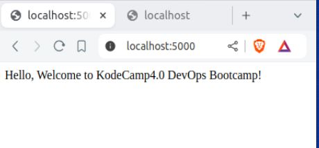
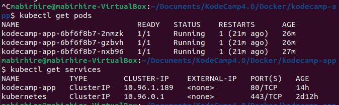
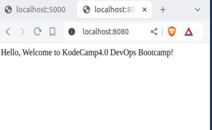

# KodeCamp App Deployment

## Objective

Strengthen your knowledge and skills with Docker and Kubernetes by creating a simple application, containerizing it, and deploying it to a Kubernetes cluster.

## Prerequisites

- Docker installed on your local machine
- Minikube installed and running
- Kubectl installed and configured

## Deployment Steps

### Create a Simple Web Application:
   - Use Python with Flask to display "Hello, Welcome to KodeCamp DevOps Bootcamp!"

### Dockerize the Application:
   - Write a Dockerfile
   - Tag and push Docker image to Docker Hub

Docker Hub URL: https://hub.docker.com/r/mabirhire1/kodecamp-app

### Deploy to Kubernetes:
   - Create Kubernetes deployment and service manifests
   - Deploy to Minikube cluster

### Test the Deployment:
   - Port-forward the service to localhost and verify the application

## Troubleshooting

### Common Issues

1. **ImagePullBackOff:**
   - Check the image name and tag
   - Ensure the image is available in the registry
   - Verify credentials for private repositories

2. **Pod CrashLoopBackOff:**
   - Check pod logs using `kubectl logs <pod-name>`
   - Verify application configuration and dependencies

## Clean Up

1. **To delete the resources,use:** 
   - Kubectl delete -f deployment.yaml
   - Kubectl delete -f service.yaml

## Additional Resources

  -  Docker Documentation
  -  Kubernetes Documentation
  -  Minikube Documentation
